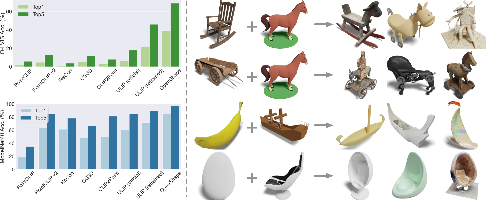

# OpenShape: Scaling Up 3D Shape Representation Towards Open-World Understanding
 [\[project\]](https://colin97.github.io/OpenShape/) [\[paper\]](https://arxiv.org/pdf/2305.10764.pdf)  [\[Live Demo\]](https://huggingface.co/spaces/OpenShape/openshape-demo) 

[***News***] [Live demo](https://huggingface.co/spaces/OpenShape/openshape-demo) released! Thanks HuggingFace🤗 for sponsoring this demo!!

Official code of "OpenShape: Scaling Up 3D Shape Representation Towards Open-World Understanding".

Code is coming soon, stay tuned!


Left: Zero-shot 3D shape classification on the Objaverse-LVIS (1,156 categories) and ModelNet40 datasets (40 common categories). Right: Our shape representations encode a broad range of semantic and visual concepts. We input two 3D shapes and use their shape embeddings to retrieve the top three shapes whose embeddings are simultaneously closest to both inputs.

## Online Demo

You can try the online [demo](https://huggingface.co/spaces/OpenShape/openshape-demo), which currently supports: (a) 3D shape classification (LVIS categories and user-uploaded texts), (b) 3D shape retrieval (from text, image, and 3D point clouds), (c) point cloud captioning, and (d) point cloud based image generation.

The demo is built with [streamlit](https://streamlit.io). If you encounter "connection error", please try to clear your browser cache or use the incognito model. The code for the demo can be found from [here](https://huggingface.co/OpenShape/openshape-demo-support/tree/main) and [here](https://huggingface.co/spaces/OpenShape/openshape-demo/tree/main). 

## Installation

If you would to run the inference or (and) training locally, you may need to install the dependendices.

1. Create a conda environment and install [pytorch](https://pytorch.org/get-started/previous-versions/), [MinkowskiEngine](https://nvidia.github.io/MinkowskiEngine/quick_start.html), and [DGL](https://www.dgl.ai/pages/start.html) by the following commands or their official guides:
```
conda create -n OpenShape python=3.9
conda activate OpenShape
conda install pytorch==1.12.1 torchvision==0.13.1 torchaudio==0.12.1 cudatoolkit=11.3 -c pytorch
pip install -U git+https://github.com/NVIDIA/MinkowskiEngine
conda install -c dglteam/label/cu113 dgl
```
2. Install the following packages:
```
pip install huggingface_hub wandb omegaconf torch_redstone einops tqdm open3d 
```

## Training

1. The processed training and evaluation data can be found [here](https://huggingface.co/datasets/OpenShape/openshape-training-data). Download and uncompress the data by the following command:
```
python3 download_data.py
```
The total data size is ~205G and will be downloaded in parallel. If you don't need training and evaluation on the Objaverse dataset, you can skip that part (~185G). 

2. Run the training by the following command:
```
wandb login {YOUR_WANDB_ID}
python3 src/main.py dataset.train_batch_size=20 --trial_name bs_20
```
The default config can be found in `src/configs/train.yml`, which is trained on a single A100 GPU. You can also change the setting by passing the arguments. Here are some examples used in the paper:

```
python3 src/mian.py --trail_name spconv_all
python3 src/main.py dataset.train_split=meta_data/split/train_no_lvis.json --trail_name spconv_no_lvis
python3 src/main.py dataset.train_split=meta_data/split/ablation/train_shapenet_only.json --trail_name spconv_shapenet_only
python3 src/main.py model.name=PointBERT model.scaling=4 model.use_dense=True training.lr=0.0005 training.lr_decay_rate=0.967 --trail_name pointbert_all
python3 src/main.py model.name=PointBERT model.scaling=4 model.use_dense=True training.lr=0.0005 training.lr_decay_rate=0.967 dataset.train_split=meta_data/split/train_no_lvis.json --trail_name pointbert_no_lvis
python3 src/main.py model.name=PointBERT model.scaling=4 model.use_dense=True training.lr=0.0005 training.lr_decay_rate=0.967 dataset.train_split=meta_data/split/ablation/train_shapenet_only.json --trail_name pointbert_shapenet_only
```

## Training and Evaluation Data 
### Training Data
Training data includes 

## Citation

If you find our code helpful, please cite our paper:

```
@misc{liu2023openshape,
      title={OpenShape: Scaling Up 3D Shape Representation Towards Open-World Understanding}, 
      author={Minghua Liu and Ruoxi Shi and Kaiming Kuang and Yinhao Zhu and Xuanlin Li and Shizhong Han and Hong Cai and Fatih Porikli and Hao Su},
      year={2023},
      eprint={2305.10764},
      archivePrefix={arXiv},
      primaryClass={cs.CV}
}
```
